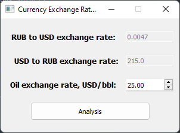
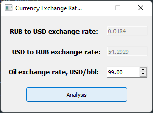

## Лабораторная работа №2

### Задание 
Реализовать приложение на PyQt с использованием сигнал-слот взаимодействия.
Например, приложение генератор курсов валют на торговом рынке, хранящий три связанных курса: рубль –доллар и котировку текущей стоимости нефти.
При увеличении стоимости нефти рубль увеличивает стоимость => посылается сигнал «классу «рубля»».
При уменьшении стоимости нефти доллар увеличивает стоимость => посылается сигнал «классу «доллара»».
Курсы доллара и рубля связаны между собой коэффициентом и изменяются, например, 2, любой.
Все изменения делать при нажатии на кнопку анализ.

### Результат

