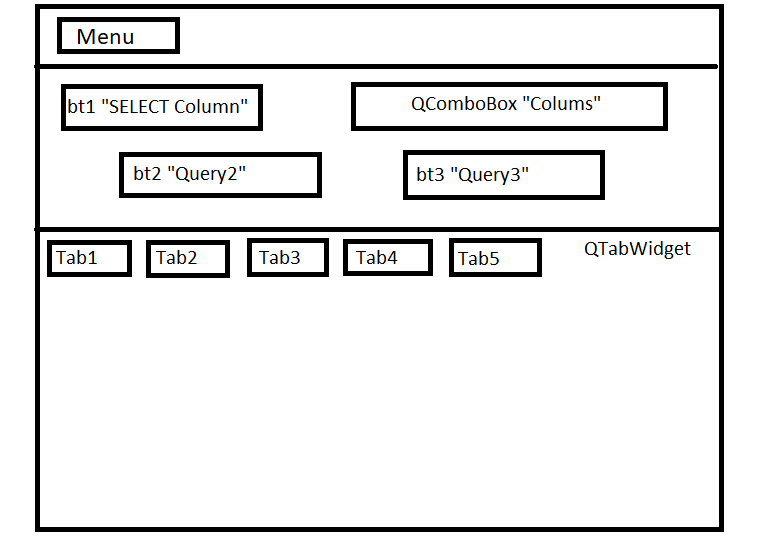
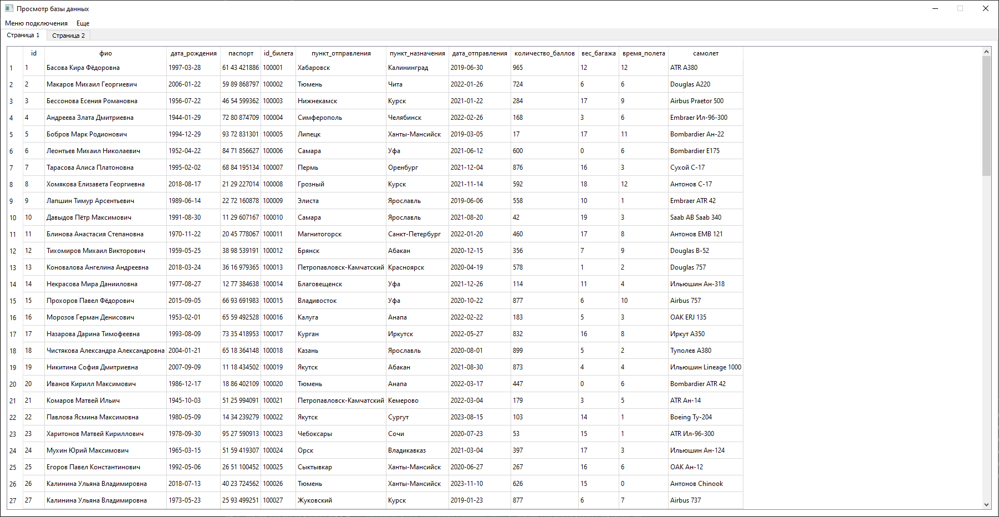

## Лабораторная работа №3

### Задание
Реализовать приложение на PyQt с использованием представления таблиц и работы с SQL.
В меню две вкладки: Set connection (установить соединение с бд), Close connection (очистить все, закрыть соединение с бд).
По умолчанию можно сделать в QTabWidget вкладки пустыми, либо создавать их по выполнению запросов при нажатии на функциональные клавиши.
Сразу после успешного коннета в Tab1 устанавливается таблица, соответствующая запросу «SELECT * FROM sqlite_master».
Кнопка bt1 делает выборочный запрос, например, «SELECT name FROM sqlite_master», результат выводится в Tab2.
При выборе колонки из выпадающего списка QComboBox результат соотвествующего запроса отправляется в Tab3.
Кнопки bt2 и bt3 выполняют запрос по выводу таблицы в Tab4 и Tab5
Иллюстрация пример



### Ход работы

Необходимо создать БД и выполнить скрипт на создание таблицы:

```sql
CREATE TABLE IF NOT EXISTS public.gui_table
(
    id integer NOT NULL,
    "фио" character varying(200) COLLATE pg_catalog."default" NOT NULL,
    "дата_рождения" date NOT NULL,
    "паспорт" character varying(50) COLLATE pg_catalog."default" NOT NULL,
    "id_билета" character varying(50) COLLATE pg_catalog."default" NOT NULL,
    "пункт_отправления" character varying(50) COLLATE pg_catalog."default" NOT NULL,
    "пункт_назначения" character varying(50) COLLATE pg_catalog."default" NOT NULL,
    "дата_отправления" date NOT NULL,
    "количество_баллов" character varying(50) COLLATE pg_catalog."default" NOT NULL,
    "вес_багажа" character varying(50) COLLATE pg_catalog."default" NOT NULL,
    "время_полета" character varying(50) COLLATE pg_catalog."default" NOT NULL,
    "самолет" character varying(50) COLLATE pg_catalog."default" NOT NULL,
    CONSTRAINT gui_table_pkey PRIMARY KEY (id),
    CONSTRAINT "gui_table_id_билета_key" UNIQUE ("id_билета")
)
```

В данной работе была использована СУБД PostgreSQL. Можно заполнить таблицу тестовыми данными с помощью скрипта:
```sql
INSERT INTO public.gui_table(
	id, "фио", "дата_рождения", "паспорт", "id_билета", "пункт_отправления", "пункт_назначения", "дата_отправления", "количество_баллов", "вес_багажа", "время_полета", "самолет")
	VALUES (1, 'test', current_date, 'test', 1, 'test', 'test', current_date, 1, 1, 'test', 'test'),
	(2, 'test', current_date, 'test', 2, 'test', 'test', current_date, 2, 1, 'test', 'test'),
	(3, 'test', current_date, 'test', 3, 'test', 'test', current_date, 3, 1, 'test', 'test'),
	(4, 'test', current_date, 'test', 4, 'test', 'test', current_date, 4, 1, 'test', 'test'),
	(5, 'test', current_date, 'test', 5, 'test', 'test', current_date, 5, 1, 'test', 'test'),
	(6, 'test', current_date, 'test', 6, 'test', 'test', current_date, 6, 1, 'test', 'test'),
	(7, 'test', current_date, 'test', 7, 'test', 'test', current_date, 7, 1, 'test', 'test'),
	(8, 'test', current_date, 'test', 8, 'test', 'test', current_date, 8, 1, 'test', 'test');
```

### Результат

